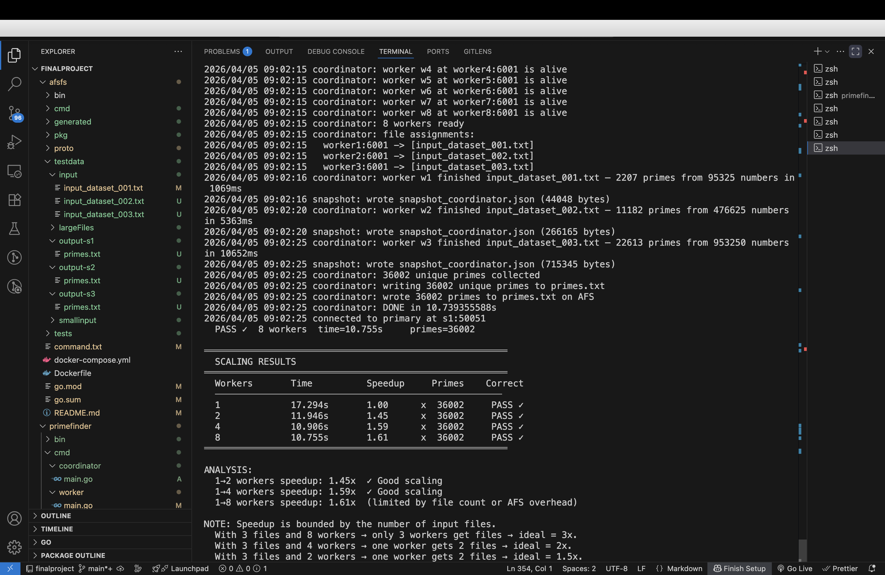
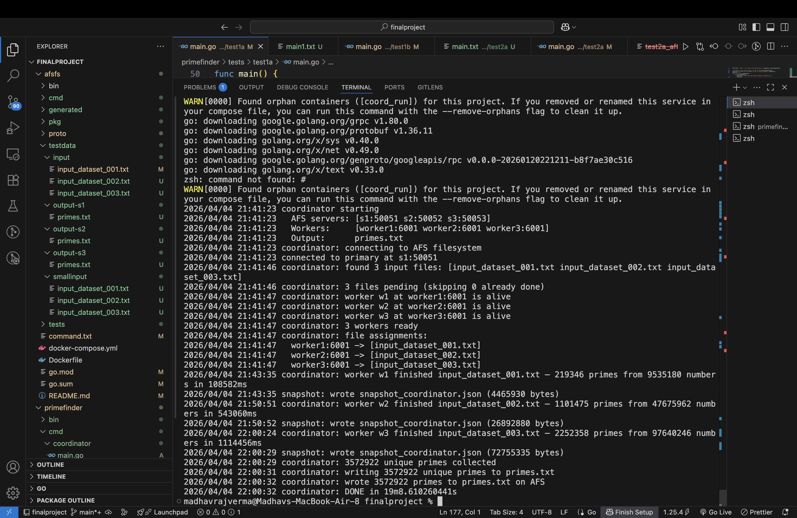

# Distributed prime number finding application

A distributed platform for discovering large prime numbers across Gigabytes of numerical data. The platform combines a fault-tolerant distributed filesystem with an embarrassingly parallel prime-finding application, both implemented from scratch in Go using gRPC.

**No external consensus libraries. No MapReduce frameworks. No shared databases. Built from first principles.**


## What this project is

PrimeScience is a two-part distributed systems project:

**Part 1 : AFS Distributed Filesystem** is a user-space filesystem inspired by the Andrew File System. It stores input datasets and output results across three replica servers. Clients get a simple `Open / Read / Write / Close` API that looks like local I/O but is backed by a fault-tolerant replicated storage layer.

**Part 2 :Distributed Prime Finder** is the application layer. A coordinator assigns large input files to parallel workers. Each worker fetches its file from AFS, tests every number for primality using deterministic Miller-Rabin, and returns results. The coordinator deduplicates, sorts, and writes the final `primes.txt` to AFS. Chandy-Lamport snapshots enable crash recovery without restarting computation from zero.


Workers are stateless compute nodes that are also AFS clients  they fetch input files directly from AFS, process them locally, and return results. The coordinator owns global deduplication and checkpointing. AFS handles all persistence and replication transparently.

---

## Five success metrics

| Metric | How it is satisfied |
|--------|---------------------|
| **Scale** | Files distributed across N workers. Each worker processes its file locally after one AFS fetch. Adding workers scales linearly — primality testing is embarrassingly parallel. |
| **Survive** | 3 AFS servers survive any one failure. Bully election promotes a backup to primary in ~3 seconds. Clients auto-reconnect. Workers are reassigned on crash. |
| **Recover** | Coordinator saves a Chandy-Lamport snapshot to AFS after every completed file. On restart it resumes from the snapshot — skips completed files, reuses collected primes. Maximum work lost = one file. |
| **Perform** | 3 workers process 3 files simultaneously. Throughput scales linearly with number of workers. Test 5A demonstrates measured speedup with a scaling table. |
| **Deliver** | Deterministic Miller-Rabin with 12 witnesses — correct for all 64-bit unsigned integers. Two-level deduplication (worker + coordinator). AFS whole-file semantics prevent partial writes. Output replicated to all 3 servers. |

---

## Part 1 — AFS Distributed Filesystem

### What it does

Stores large input datasets and output result files across a cluster of servers. Gives clients a simple file API that looks like local I/O but is backed by fault-tolerant replicated storage.

### Key features

| Feature | Mechanism |
|---------|-----------|
| Remote file access | Open, Read, Write, Close, Create, Delete over gRPC |
| Whole-file caching | Client fetches entire file on first open — all subsequent reads are local disk I/O |
| Cache consistency | `TestAuth` RPC checks server version before trusting local copy |
| High availability | 3 replica servers — system survives any one server failure |
| Automatic failover | Heartbeat-based failure detection + lowest-ID bully election |
| Self-healing | Recovered server pulls all missed files from current primary via `SyncState` |
| Idempotency | Every mutating RPC carries `(clientID, reqSeq)` — server-side dedup table prevents double execution on retry |
| Atomic writes | `WriteFile + Rename` on server — partial writes never corrupt the stored file |

### Tasks implemented

| Task | Feature |
|------|---------|
| **1A** | Open, Read, Write, Close, Create, Delete over gRPC — `proto/afs.proto` |
| **1B** | Whole-file caching with `TestAuth` version validation |
| **2** | At-least-once RPCs, client crash safety, idempotency via `clientID + reqSeq` |
| **3** | Primary-backup replication, heartbeat failure detection, bully election, client failover, server recovery sync |


## Part 2 — Distributed Prime Finder
### What it does

Reads large input files from AFS, tests every number for primality in parallel across multiple workers, deduplicates all results, and writes a sorted `primes.txt` back to AFS. Crash recovery is handled via Chandy-Lamport snapshots stored on AFS.

### Key features

| Feature | Mechanism |
|---------|-----------|
| Parallel processing | One goroutine per worker — workers run assigned files simultaneously |
| Correct primality | Deterministic Miller-Rabin with 12 witnesses — correct for all `uint64` |
| Worker failover | Coordinator reassigns a dead worker's file to any surviving worker |
| Cross-file dedup | Coordinator maintains a global `seen` map — duplicates across files never appear in output |
| Chandy-Lamport snapshots | Coordinator checkpoints to AFS after every file — resumes on crash without reprocessing completed work |
| AFS integration | Workers are AFS clients — files fetched, cached locally, reads are pure local I/O |

### Tasks implemented

| Task | Feature |
|------|---------|
| **4** | Coordinator-worker architecture, file discovery, round-robin assignment, parallel dispatch, worker failover, cross-file dedup, output written to AFS |
| **5** | Chandy-Lamport consistent snapshots on AFS, coordinator resume from snapshot, per-worker snapshot, HTTP `/snapshot` endpoint on each worker |


## Running with Docker (recommended)
The entire platform runs with a single `docker compose` command. All services are on one Docker bridge network containers discover each other by hostname.


## Test suite
All testcases from the specification are implemented as Go programs in `primefinder/tests/`.
Full run instructions:
| Test | What it proves |
|------|----------------|
| `test1a` | Single worker, single file — correct primes, no duplicates, no misses |
| `test1b` | Multiple workers, multiple files — correct merged output, cross-file dedup |
| `test2a` | Server crash during read — whole-file cache survives, new primary found |
| `test2b` | Client crash during write — partial write never reaches server |
| `test3` | Replication + failover + recovery — all 3 servers consistent throughout |
| `test4a` | Coordinator crash — resumes from Chandy-Lamport snapshot |
| `test4b` | Single worker failure — coordinator reassigns, output still correct |
| `test4c` | Majority worker failure — snapshot + surviving worker = correct output |
| `test5a` | Throughput scaling — speedup table for 1, 2, 3 workers |
| `test5b` | Large dataset — correctness and stability under load |


## Results for large Files optional test cases 

## | `test5a` | Throughput scaling — speedup table for 1, 2, 4,8 workers |




## | `test5b` | Throughput scaling — speedup table for 1, 2, 4,8 workers |




## How to Run
### Option A — Docker

#### 1. Build everything

```bash
docker compose build
```

#### 2. Start AFS servers

```bash
docker compose up -d s1 s2 s3
docker compose ps
```

#### 3. Start workers

```bash
docker compose up -d worker1 worker2 worker3
docker compose ps
```

#### 4. Build coordinator and worker binaries inside tester

```bash
docker compose run --rm tester go build -o bin/coordinator ./cmd/coordinator
docker compose run --rm tester go build -o bin/worker      ./cmd/worker
```

#### 5. Normal run — coordinator processes all files

```bash
docker compose --profile run run --rm coordinator
# If image is stale, rebuild first:
# docker compose --profile run build --no-cache coordinator
```

#### 6. Verify output on all 3 servers

```bash
docker exec s1 wc -l /data/output/primes.txt
docker exec s2 wc -l /data/output/primes.txt
docker exec s3 wc -l /data/output/primes.txt

# Snapshot must be cleaned up after successful run
docker exec s1 ls /data/output/snapshot_*.json 2>/dev/null || echo "clean — no leftover snapshot"
```

#### Reset between tests

```bash
docker exec s1 sh -c 'rm -f /data/output/*.txt /data/output/snapshot_*.json'
docker exec s2 sh -c 'rm -f /data/output/*.txt /data/output/snapshot_*.json'
docker exec s3 sh -c 'rm -f /data/output/*.txt /data/output/snapshot_*.json'
```

#### Test 1A — Single Worker, Single File

**Proves:** One worker processes one file correctly. Output is valid primes, no duplicates, no misses.

```bash
docker exec s1 sh -c 'rm -f /data/output/*'
docker exec s2 sh -c 'rm -f /data/output/*'
docker exec s3 sh -c 'rm -f /data/output/*'

docker compose run --rm tester ./bin/coordinator \
  -afs s1:50051,s2:50052,s3:50053 \
  -workers worker1:6001 \
  -cacheDir /tmp/coord-1a \
  -output primes.txt

docker compose run --rm tester go run tests/test1a/main.go \
  -servers s1:50051,s2:50052,s3:50053 \
  -cacheDir /tmp/test1a \
  -inputFile input_dataset_001.txt \
  -outputFile primes.txt
```

Expected: PASS output exists, PASS all prime, PASS no duplicates, PASS no misses.


#### Test 1B — Multiple Workers, Multiple Files

**Proves:** 3 workers process 3 files in parallel. Merged output has no cross-file duplicates.

```bash
docker exec s1 sh -c 'rm -f /data/output/*'
docker exec s2 sh -c 'rm -f /data/output/*'
docker exec s3 sh -c 'rm -f /data/output/*'

docker compose run --rm tester ./bin/coordinator \
  -afs s1:50051,s2:50052,s3:50053 \
  -workers worker1:6001,worker2:6001,worker3:6001 \
  -cacheDir /tmp/coord-1b \
  -output primes.txt

docker compose run --rm tester go run tests/test1b/main.go \
  -servers s1:50051,s2:50052,s3:50053 \
  -cacheDir /tmp/test1b \
  -outputFile primes.txt
```

Expected: PASS output exists, PASS all prime, PASS no cross-file duplicates, PASS no misses.


#### Test 2A — Server Crash During Coordinator Run

**Proves:** s1 dies mid-run, election elects new primary, coordinator completes, s1 syncs on restart.

**Terminal 1:**
```bash
docker exec s1 sh -c 'rm -f /data/output/*'
docker exec s2 sh -c 'rm -f /data/output/*'
docker exec s3 sh -c 'rm -f /data/output/*'

docker compose run --rm tester ./bin/coordinator \
  -afs s1:50051,s2:50052,s3:50053 \
  -workers worker1:6001,worker2:6001,worker3:6001 \
  -cacheDir /tmp/coord-2a \
  -output primes.txt
```

**Terminal 2** (after ~5 seconds):
```bash
sleep 5
docker compose stop s1
echo "s1 killed — election starting"
sleep 6
docker compose logs s2 | tail -5
docker compose logs s3 | tail -5
```

**After coordinator finishes:**
```bash
docker compose start s1
sleep 5

docker compose run --rm tester go run tests/test2a/main.go \
  -servers s1:50051,s2:50052,s3:50053 \
  -cacheDir /tmp/test2a \
  -outputFile primes.txt
```

Expected: PASS output exists, PASS all primes correct, PASS no duplicates, PASS s1 synced via SyncState.


#### Test 2B — Client Crash Before Close

**Proves:** Write() is local-only. No Close() = no StoreFile. Server never sees partial data.

```bash
docker exec s1 sh -c 'rm -f /data/output/*'
docker exec s2 sh -c 'rm -f /data/output/*'
docker exec s3 sh -c 'rm -f /data/output/*'

docker compose run --rm tester go run tests/test2b/main.go \
  -servers s1:50051,s2:50052,s3:50053 \
  -cacheDir /tmp/test2b
```

Expected: PASS v1 committed, PASS server has v1 (crash content never sent), PASS all 3 servers have v1.


#### Test 3A — Replication

**Proves:** Write via primary replicates to ALL 3 servers before returning success.

```bash
docker exec s1 sh -c 'rm -f /data/output/*'
docker exec s2 sh -c 'rm -f /data/output/*'
docker exec s3 sh -c 'rm -f /data/output/*'

docker compose --profile run run --rm coordinator

docker compose run --rm tester go run tests/test3/main.go \
  -servers s1:50051,s2:50052,s3:50053 \
  -cacheDir /tmp/test3a
```

Expected: PASS s1 has content, PASS s2 has content, PASS s3 has content, PASS all 3 servers identical.


#### Test 3B — Primary Failover

**Proves:** s1 dies mid-run, new primary elected, coordinator completes, s2/s3 consistent.

**Terminal 1:**
```bash
docker compose start s1
sleep 3
docker exec s1 sh -c 'rm -f /data/output/*'
docker exec s2 sh -c 'rm -f /data/output/*'
docker exec s3 sh -c 'rm -f /data/output/*'

docker compose run --rm tester ./bin/coordinator \
  -afs s1:50051,s2:50052,s3:50053 \
  -workers worker1:6001,worker2:6001,worker3:6001 \
  -cacheDir /tmp/coord-3b \
  -output primes.txt
```

**Terminal 2** (after ~5 seconds):
```bash
sleep 5 && docker compose stop s1 && echo "s1 killed"
```

**After coordinator finishes:**
```bash
docker compose run --rm tester go run tests/test3b/main.go \
  -servers s1:50051,s2:50052,s3:50053 \
  -cacheDir /tmp/test3b \
  -outputFile primes.txt
```

Expected: PASS new primary elected, PASS write succeeded on new primary, PASS s2 and s3 have identical content.


#### Test 3C — Recovery and State Sync

**Proves:** s1 restarts and automatically syncs all files it missed via SyncState.

```bash
docker compose start s1
sleep 10

docker compose run --rm tester go run tests/test3c/main.go \
  -servers s1:50051,s2:50052,s3:50053 \
  -cacheDir /tmp/test3c \
  -outputFile primes.txt

docker compose logs s1 | grep -i "synced\|SyncState"
```

Expected: PASS s1 has primes.txt via SyncState, PASS all 3 servers identical.


#### Test 4A — Coordinator Failure and Resume

**Proves:** Coordinator restores from Chandy-Lamport snapshot — skips completed files, reuses collected primes. Resumed output is identical to a full run.

```bash
docker exec s1 sh -c 'rm -f /data/output/*'
docker exec s2 sh -c 'rm -f /data/output/*'
docker exec s3 sh -c 'rm -f /data/output/*'

docker compose run --rm tester go run tests/test4a/main.go \
  -servers s1:50051,s2:50052,s3:50053 \
  -workers worker1:6001,worker2:6001,worker3:6001 \
  -coordBin ./bin/coordinator \
  -cacheDir /tmp/test4a
```

Expected: PASS full run N primes, PASS coordinator resumed from snapshot, PASS resumed output identical to full run, PASS no duplicates.


#### Test 4B — Single Worker Failure

**Proves:** Coordinator reassigns a dead worker's file to a surviving worker. Final output correct.

```bash
docker compose start s1 worker1 worker2 worker3
sleep 3
docker exec s1 sh -c 'rm -f /data/output/*'
docker exec s2 sh -c 'rm -f /data/output/*'
docker exec s3 sh -c 'rm -f /data/output/*'

docker compose run --rm tester go run tests/test4b/main.go \
  -servers s1:50051,s2:50052,s3:50053 \
  -workers worker1:6001,worker2:6001,worker3:6001 \
  -coordBin ./bin/coordinator \
  -cacheDir /tmp/test4b \
  -docker=true

docker compose start worker1
```

Expected: PASS output matches ground truth, PASS no duplicates, PASS worker1 restarted.


#### Test 4C — Multiple Worker Failure

**Proves:** Majority workers killed. Coordinator snapshot + surviving worker3 produces correct output.

```bash
docker compose start s1 worker1 worker2 worker3
sleep 3
docker exec s1 sh -c 'rm -f /data/output/*'
docker exec s2 sh -c 'rm -f /data/output/*'
docker exec s3 sh -c 'rm -f /data/output/*'

docker compose run --rm tester go run tests/test4c/main.go \
  -servers s1:50051,s2:50052,s3:50053 \
  -workers worker1:6001,worker2:6001,worker3:6001 \
  -coordBin ./bin/coordinator \
  -cacheDir /tmp/test4c \
  -docker=true

docker compose start worker1 worker2
```

Expected: PASS coordinator resumes from snapshot, PASS output matches ground truth, PASS no duplicates.


#### Test 5A — Throughput Scaling

**Proves:** More workers = faster processing. Prints a scaling table with 1, 2, 4, 8 workers.

```bash
docker compose up -d worker4 worker5 worker6 worker7 worker8

docker exec s1 sh -c 'rm -f /data/output/*'
docker exec s2 sh -c 'rm -f /data/output/*'
docker exec s3 sh -c 'rm -f /data/output/*'

docker compose run --rm tester go run tests/test5a/main.go \
  -servers s1:50051,s2:50052,s3:50053 \
  -w1 worker1:6001 \
  -w2 worker1:6001,worker2:6001 \
  -w4 worker1:6001,worker2:6001,worker3:6001,worker4:6001 \
  -w8 worker1:6001,worker2:6001,worker3:6001,worker4:6001,worker5:6001,worker6:6001,worker7:6001,worker8:6001 \
  -coordBin ./bin/coordinator \
  -cacheDir /tmp/test5a
```

Expected: PASS all runs identical prime count, speedup improves with more workers, 1 to 8 workers speedup ~3x (bounded by 3 input files).


#### Test 5B — Large Dataset

**Proves:** System handles large 64-bit number datasets correctly with no duplicates, all primes valid, and no corruption.

```bash
docker exec s1 sh -c 'rm -f /data/output/*'
docker exec s2 sh -c 'rm -f /data/output/*'
docker exec s3 sh -c 'rm -f /data/output/*'

docker compose run --rm tester go run tests/test5b/main.go \
  -servers s1:50051,s2:50052,s3:50053 \
  -workers worker1:6001,worker2:6001,worker3:6001 \
  -coordBin ./bin/coordinator \
  -cacheDir /tmp/test5b \
  -count 500000
```

Expected: PASS uploaded to AFS, PASS all output entries are prime, PASS no duplicates, PASS AFS returned correct bytes with no corruption.


### Option B — Run Locally (No Docker)

#### 1. Build

```bash
cd afsfs
go build -o bin/server ./cmd/server

cd ../primefinder
go build -o bin/coordinator ./cmd/coordinator
go build -o bin/worker      ./cmd/worker
```

#### 2. Generate test data

```bash
cd finalproject
chmod +x generate_testdata_small.sh
./generate_testdata_small.sh
# Creates input_dataset_001.txt (1MB), 002 (5MB), 003 (10MB)

# For large dataset tests (2A requires large files for mid-transfer kill):
pip3 install numpy
chmod +x generate_testdata.sh
./generate_testdata.sh   # ~5 min, creates 100MB + 500MB + 1GB
```

#### 3. Start AFS servers (3 terminals)

```bash
# Terminal 1
cd afsfs
./bin/server -id s1 -host localhost -port 50051 -primary=true \
  -peers s2=localhost:50052,s3=localhost:50053 \
  -inputDir ./testdata/input -outputDir ./testdata/output-s1

# Terminal 2
./bin/server -id s2 -host localhost -port 50052 -primary=false \
  -peers s1=localhost:50051,s3=localhost:50053 \
  -inputDir ./testdata/input -outputDir ./testdata/output-s2

# Terminal 3
./bin/server -id s3 -host localhost -port 50053 -primary=false \
  -peers s1=localhost:50051,s2=localhost:50052 \
  -inputDir ./testdata/input -outputDir ./testdata/output-s3
```

#### 4. Start workers (3 terminals)

```bash
# Terminal 4
cd primefinder
./bin/worker -id w1 -port 6001 -snapshotPort 6100

# Terminal 5
./bin/worker -id w2 -port 6002 -snapshotPort 6101

# Terminal 6
./bin/worker -id w3 -port 6003 -snapshotPort 6102
```

#### 5. Normal run

```bash
cd primefinder
S="localhost:50051,localhost:50052,localhost:50053"
W="localhost:6001,localhost:6002,localhost:6003"

./bin/coordinator -afs $S -workers $W \
  -cacheDir /tmp/coord-cache -output primes.txt
```

#### 6. Verify output

```bash
wc -l afsfs/testdata/output-s1/primes.txt
diff afsfs/testdata/output-s1/primes.txt afsfs/testdata/output-s2/primes.txt && echo "s1==s2 ✓"
diff afsfs/testdata/output-s1/primes.txt afsfs/testdata/output-s3/primes.txt && echo "s1==s3 ✓"
```

#### Reset between tests

```bash
rm -f afsfs/testdata/output-s*/primes.txt
rm -f afsfs/testdata/output-s*/snapshot_*.json
rm -f afsfs/testdata/output-s*/test*.txt
```


#### Test 1A — Single Worker, Single File

```bash
cd primefinder
S="localhost:50051,localhost:50052,localhost:50053"

rm -f afsfs/testdata/output-s*/primes.txt

./bin/coordinator -afs $S -workers localhost:6001 \
  -cacheDir /tmp/coord-1a -output primes.txt

go run tests/test1a/main.go \
  -servers $S -cacheDir /tmp/test1a \
  -inputFile input_dataset_001.txt -outputFile primes.txt
```

Expected: PASS output exists, PASS all prime, PASS no duplicates, PASS no misses.


#### Test 1B — Multiple Workers, Multiple Files

```bash
S="localhost:50051,localhost:50052,localhost:50053"
W="localhost:6001,localhost:6002,localhost:6003"

rm -f afsfs/testdata/output-s*/primes.txt

./bin/coordinator -afs $S -workers $W \
  -cacheDir /tmp/coord-1b -output primes.txt

go run tests/test1b/main.go \
  -servers $S -cacheDir /tmp/test1b -outputFile primes.txt
```

Expected: PASS output exists, PASS all prime, PASS no cross-file duplicates, PASS no misses.


#### Test 2A — Server Crash During Coordinator Run

```bash
S="localhost:50051,localhost:50052,localhost:50053"
W="localhost:6001,localhost:6002,localhost:6003"

rm -f afsfs/testdata/output-s*/primes.txt
```

**Terminal 1:**
```bash
./bin/coordinator -afs $S -workers $W \
  -cacheDir /tmp/coord-2a -output primes.txt
```

**Terminal 2** (after ~5 seconds):
```bash
sleep 5
kill $(lsof -ti:50051 -sTCP:LISTEN)
echo "s1 killed"
```

**After coordinator finishes — restart s1 and verify:**
```bash
cd afsfs
./bin/server -id s1 -host localhost -port 50051 -primary=false \
  -peers s2=localhost:50052,s3=localhost:50053 \
  -inputDir ./testdata/input -outputDir ./testdata/output-s1 &
sleep 8

cd ../primefinder
go run tests/test2a/main.go \
  -servers $S -cacheDir /tmp/test2a -outputFile primes.txt
```

Expected: PASS output exists, PASS all primes correct, PASS no duplicates, PASS s1 synced via SyncState.


#### Test 2B — Client Crash Before Close

```bash
S="localhost:50051,localhost:50052,localhost:50053"

go run tests/test2b/main.go -servers $S -cacheDir /tmp/test2b
```

Expected: PASS v1 committed, PASS server has v1 (crash content never sent), PASS all 3 servers have v1.


#### Test 3A — Replication

```bash
S="localhost:50051,localhost:50052,localhost:50053"

rm -f afsfs/testdata/output-s*/primes.txt

./bin/coordinator -afs $S \
  -workers localhost:6001,localhost:6002,localhost:6003 \
  -cacheDir /tmp/coord-3a -output primes.txt

go run tests/test3/main.go -servers $S -cacheDir /tmp/test3a
```

Expected: PASS s1 has content, PASS s2 has content, PASS s3 has content, PASS all 3 servers identical.


#### Test 3B — Primary Failover

**Terminal 1:**
```bash
S="localhost:50051,localhost:50052,localhost:50053"
W="localhost:6001,localhost:6002,localhost:6003"

rm -f afsfs/testdata/output-s*/primes.txt

./bin/coordinator -afs $S -workers $W \
  -cacheDir /tmp/coord-3b -output primes.txt
```

**Terminal 2** (after ~5 seconds):
```bash
sleep 5 && kill $(lsof -ti:50051 -sTCP:LISTEN) && echo "s1 killed"
```

**After coordinator finishes:**
```bash
go run tests/test3b/main.go \
  -servers $S -cacheDir /tmp/test3b -outputFile primes.txt
```

Expected: PASS new primary elected, PASS write succeeded, PASS s2 and s3 have identical content.


#### Test 3C — Recovery and State Sync

```bash
# Restart s1 as backup
cd afsfs
./bin/server -id s1 -host localhost -port 50051 -primary=false \
  -peers s2=localhost:50052,s3=localhost:50053 \
  -inputDir ./testdata/input -outputDir ./testdata/output-s1 &
sleep 10

cd ../primefinder
go run tests/test3c/main.go \
  -servers $S -cacheDir /tmp/test3c -outputFile primes.txt
```

Expected: PASS s1 has primes.txt via SyncState, PASS all 3 servers identical.


#### Test 4A — Coordinator Failure and Resume

```bash
S="localhost:50051,localhost:50052,localhost:50053"
W="localhost:6001,localhost:6002,localhost:6003"

rm -f afsfs/testdata/output-s*/primes.txt afsfs/testdata/output-s*/snapshot_*.json

go run tests/test4a/main.go \
  -servers $S -workers $W \
  -coordBin ./bin/coordinator \
  -cacheDir /tmp/test4a
```

Expected: PASS full run N primes, PASS resumed output identical to full run, PASS no duplicates.

#### Test 4B — Single Worker Failure

```bash
S="localhost:50051,localhost:50052,localhost:50053"
W="localhost:6001,localhost:6002,localhost:6003"

rm -f afsfs/testdata/output-s*/primes.txt afsfs/testdata/output-s*/snapshot_*.json

go run tests/test4b/main.go \
  -servers $S -workers $W \
  -coordBin ./bin/coordinator \
  -workerBin ./bin/worker \
  -cacheDir /tmp/test4b

# Restart worker1 after test
./bin/worker -id w1 -port 6001 -snapshotPort 6100 &
```

Expected: PASS output matches ground truth, PASS no duplicates, PASS worker1 restarted.


#### Test 4C — Multiple Worker Failure

```bash
S="localhost:50051,localhost:50052,localhost:50053"
W="localhost:6001,localhost:6002,localhost:6003"

rm -f afsfs/testdata/output-s*/primes.txt afsfs/testdata/output-s*/snapshot_*.json

go run tests/test4c/main.go \
  -servers $S -workers $W \
  -coordBin ./bin/coordinator \
  -cacheDir /tmp/test4c

# Restart workers after test
./bin/worker -id w1 -port 6001 -snapshotPort 6100 &
./bin/worker -id w2 -port 6002 -snapshotPort 6101 &
```

Expected: PASS coordinator resumes from snapshot, PASS output matches ground truth, PASS no duplicates.


#### Test 5A — Throughput Scaling

```bash
S="localhost:50051,localhost:50052,localhost:50053"

# Start extra workers for scaling test
./bin/worker -id w4 -port 6004 -snapshotPort 6104 &
./bin/worker -id w5 -port 6005 -snapshotPort 6105 &
./bin/worker -id w6 -port 6006 -snapshotPort 6106 &
./bin/worker -id w7 -port 6007 -snapshotPort 6107 &
./bin/worker -id w8 -port 6008 -snapshotPort 6108 &

rm -f afsfs/testdata/output-s*/primes.txt afsfs/testdata/output-s*/snapshot_*.json

go run tests/test5a/main.go \
  -servers $S \
  -w1 localhost:6001 \
  -w2 localhost:6001,localhost:6002 \
  -w4 localhost:6001,localhost:6002,localhost:6003,localhost:6004 \
  -w8 localhost:6001,localhost:6002,localhost:6003,localhost:6004,localhost:6005,localhost:6006,localhost:6007,localhost:6008 \
  -coordBin ./bin/coordinator \
  -cacheDir /tmp/test5a
```

Expected: PASS all runs identical prime count, speedup improves with more workers.


#### Test 5B — Large Dataset

```bash
S="localhost:50051,localhost:50052,localhost:50053"
W="localhost:6001,localhost:6002,localhost:6003"

rm -f afsfs/testdata/output-s*/primes.txt afsfs/testdata/output-s*/snapshot_*.json

go run tests/test5b/main.go \
  -servers $S -workers $W \
  -coordBin ./bin/coordinator \
  -cacheDir /tmp/test5b \
  -count 500000
```

Expected: PASS uploaded to AFS, PASS all output entries are prime, PASS no duplicates, PASS AFS no corruption.


